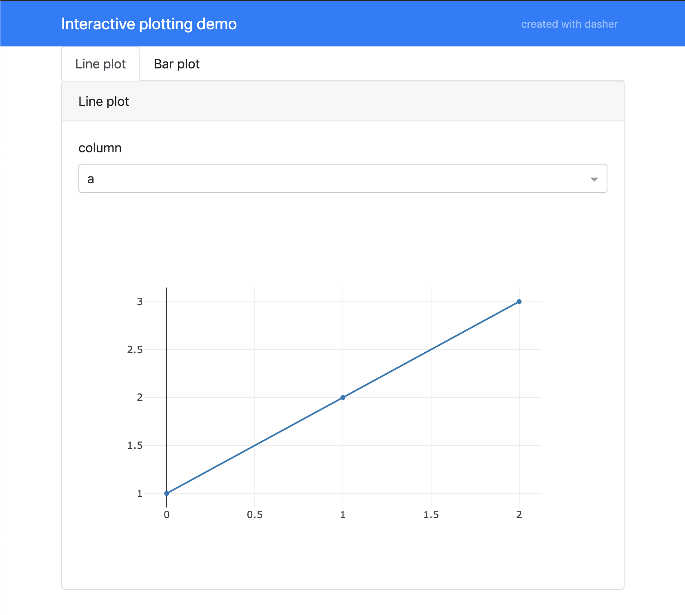

# Dasher
Generate interactive plotly dash dashboards in an instant!

## Installation

Install the module using pip::

    pip install -U dasher

## Usage
Creating a simple, interactive Dashboard with a nice layout is as easy as this:

    from dasher import Dasher
    import dash_html_components as html
    
    app = Dasher(__name__, title="My first dashboard")
    
    
    @app.callback("My first callback", "Type something...!", text="Hello World!")
    def my_callback(text):
        return [html.H1(text)]
    
    
    if __name__ == '__main__':
        app.run_server(debug=True)

The working example can be found in ``examples/readme_example.py``.

### Multiple callbacks
``dasher`` supports multiple callbacks and will autmatically create multiple tabs.
See ``examples/plot_demo.py`` for an example!

### Widget demo
For a demo of all supported automatic widgets and an example how to use custom
components, see ``examples/widget_demo.py``.

## Documentation
More documentation will arrive soon! Stay tuned!

## Authors
[Martijn Arts](https://github.com/mfaafm)

## License
[MIT license](LICENSE)