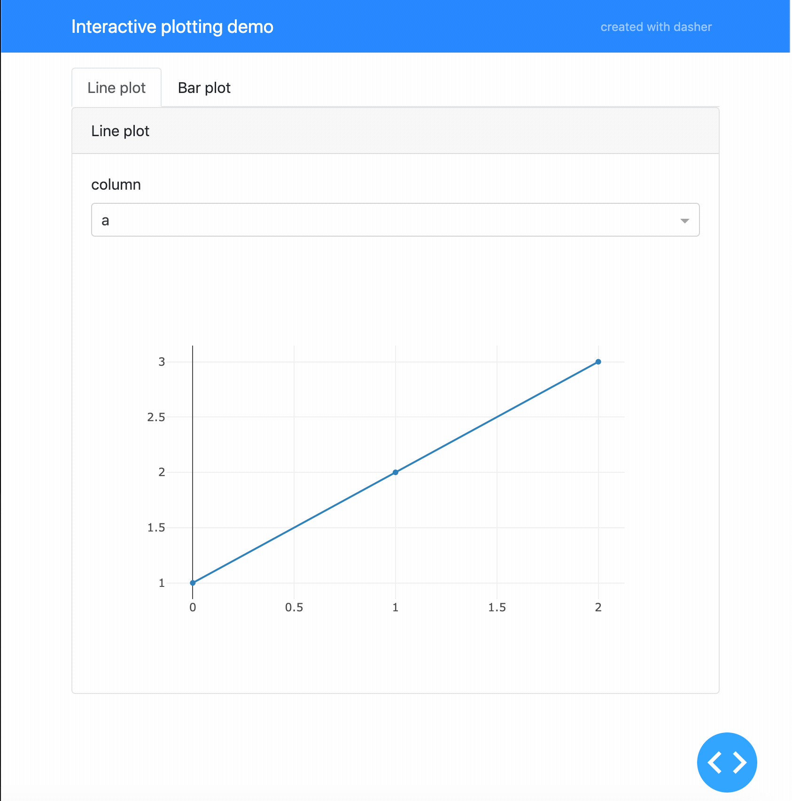

# dasher
Generate interactive plotly dash dashboards in an instant!

## Installation

Install the module using pip:

    pip install -U dasher

## Usage
Creating a simple, interactive dashboard with a nice layout is as easy as this:

    from dasher import Dasher
    import dash_html_components as html
    
    app = Dasher(__name__, title="My first dashboard")
    
    
    @app.callback(
        "My first callback",
        "Try out the widgets!",
        _labels=["Greeting", "Place"],
        text="Hello",
        place=["World", "Universe"],
    )
    def my_callback(text, place):
        msg = "{} {}!".format(text, place)
        return [html.H1(msg)]
    
    
    if __name__ == "__main__":
        app.run_server(debug=True)

The resulting dashboard looks like this:

The code for this dashboard can be found in ``examples/readme_example.py``.

## Concept
The idea behind dasher is to create auto-generated interactive 
[ploty dash](https://dash.plot.ly/) dashboards as easy as using 
[ipywidgets ``interact``](https://ipywidgets.readthedocs.io/en/stable/examples/Using%20Interact.html)
in jupyter notebooks. That is, by decorating a user defined callback function! Here,
the keyword arguments of the decorator define the interactive widgets and the callback 
function must return what you want to show in the content container in the dashboard. 

Dasher provides a simple default layout consisting of a header with the dashboard's 
title, a widget container providing the interactivity and the content container. 
The only thing you need to do in the callback function is to process the input arguments
(which correspond to the widgets) and to return a list of the plotly dash components 
that you want to appear in the content container!

The interactive widgets are automatically generated based on the type of the keyword 
arguments of the decorator. For example, a string will result in an input field and 
a list will become a dropdown box. Dasher supports the same widget abbreviations as
[ipywidgets](https://ipywidgets.readthedocs.io/en/stable/examples/Using%20Interact.html#Widget-abbreviations)
``interact``.

Since the layout and the widget connections to the callback are taken care of by
dasher, you can concentrate on what you to display on the dashboard. As a result,
generating a stunning interactive visualization becomes a matter of minutes! 

### Supported widgets
The type of a keyword argument of the ``callback`` decorator determines which widget
will be generated. All supported types and the resulting widget (dash component) 
are:
* ``bool``: Radio item (``dash_bootstrap_components.RadioItem``)
* ``str``: Input field (``dash_bootstrap_components.Input``)
* ``int``: Slider, integer (``dash_core_components.Slider``)
* ``float``: Slider, float (``dash_core_components.Slider``)
* ``tuple``: Slider, (``dash_core_components.Slider``)  
    Can be ``(min, max)`` or ``(min, max, step)``. The type of all the tuple entries
    must either be ``int`` or ``float``, which determines whether an integer or
    float slider will be generated.
* ``collections.Iterable``: Dropdown menu (``dash_core_components.Dropdown``)  
    Typically a ``list`` or anything iterable, which is not a ``tuple``.
* ``collections.Mapping``: Dropdown menu (``dash_core_components.Dropdown``)  
    Typically a ``dict``. A mapping will use the keys as labels shown in the
    dropdown menu, while the values will be used as arguments to the callback
    function.
* ``dash.development.base_component.Component``: custom dash component  
    Any dash component will be used as-is. This allows full
    customization of a widget if desired. The components ``value`` will be used
    as argument of the callback function.

### Multiple callbacks
``dasher`` supports multiple callbacks and will autmatically create multiple tabs
for you. See ``examples/plot_demo.py`` for an example!

### Widget demo
For a demo of all supported automatic widgets and an example how to use custom
components, see ``examples/widget_demo.py``.

## Authors
[Martijn Arts](https://github.com/mfaafm)

## License
[MIT license](LICENSE)