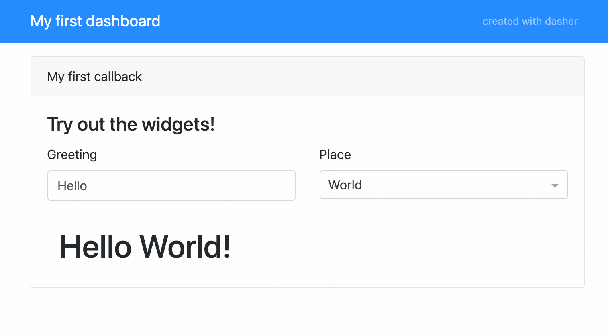
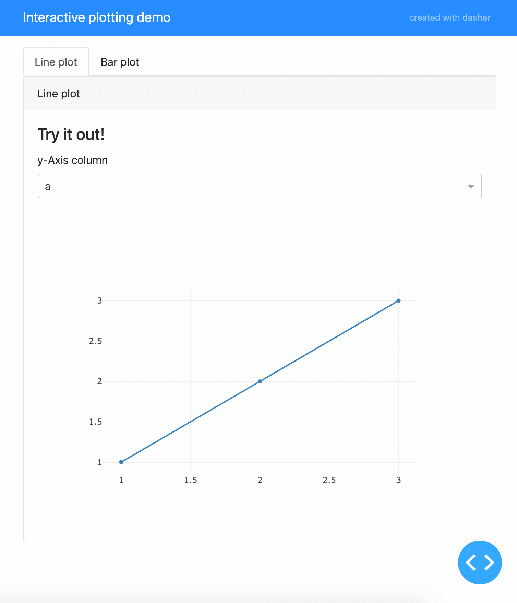

=====
Usage
=====

Getting started
===============
Creating a simple, interactive dashboard with a nice layout is as easy as this::

    from dasher import Dasher
    import dash_html_components as html

    app = Dasher(__name__, title="My first dashboard")

    @app.callback(
        _name="My first callback",
        _desc="Try out the widgets!",
        _labels=["Greeting", "Place"],
        text="Hello",
        place=["World", "Universe"],
    )
    def my_callback(text, place):
        msg = "{} {}!".format(text, place)
        return [html.H1(msg)]

    if __name__ == "__main__":
        app.run_server(debug=True)

The resulting dashboard looks like this:

The code for this dashboard can be found in ``examples/readme_example.py``.

Callbacks
=========
In general, a dasher callback is responsible for automatically generating an interactive
layout (including widgets) and connecting the generated widget to the decorated callback
function, so that it is executed when the state of the widget changes. The callback
function must return a list of dash components, which define the content that is
dependent on the widget state.

The layout of a callback contains:

* a navbar with the app title
* the name of the callback (``_name``)
* the (optional) description of the callback (``_desc``)
* the automatically generated widgets
* the main content area, which is defined by the return value of the callback

Supported widgets
=================
The type of a keyword argument of the ``callback`` decorator determines which widget
will be generated. All supported types and the resulting widget (dash component)
are:

* ``bool``: Radio Items
* ``str``: Input field
* ``int``: Slider, integer
* ``float``: Slider, floats
* ``tuple``: Slider
  Can be (min, max) or (min, max, step). The type of all the tuple entries
  must either be ``int`` or ``float``, which determines whether an integer or
  float slider will be generated.
* ``collections.Iterable``: Dropdown menu
  Typically a ``list`` or anything iterable.
* ``collections.Mapping``: Dropdown menu
  Typically a ``dict``. A mapping will use the keys as labels shown in the
  dropdown menu, while the values will be used as arguments to the callback
  function.
* ``dash.development.base_component.Component``: custom dash component
  Any dash component will be used as-is. This allows full customization of a
  widget if desired. The widgets ``value`` will be used as argument to
  the callback function.

For a demo of all supported automatic widgets and an example how to use custom
components, see ``examples/widget_demo.py``.

Multiple callbacks
==================
``dasher`` supports multiple callbacks and will autmatically create tabs to separate the
content of the callbacks.
An example dashboard with two callbacks can be found in ``examples/plot_demo.py``
and it looks like this:

Customizations
==============

Dasher API
==========
The :class:`dasher.Api` can be used to use dasher's widget auto generation features
with a fully custom layout. See ``examples/api_example.py`` for an (arguably not very
useful) example.
